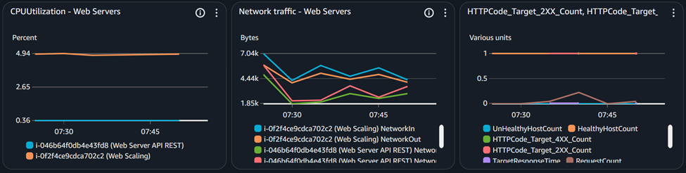
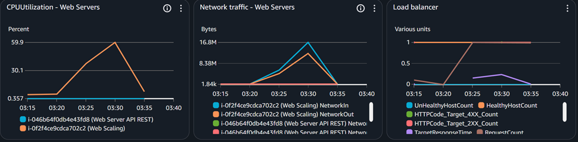
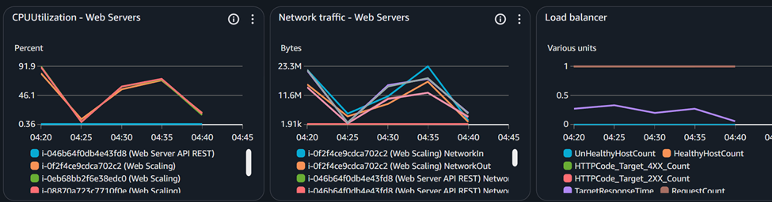
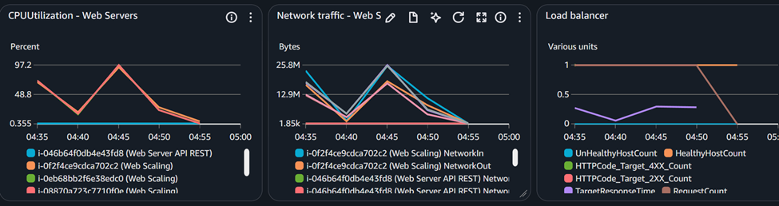
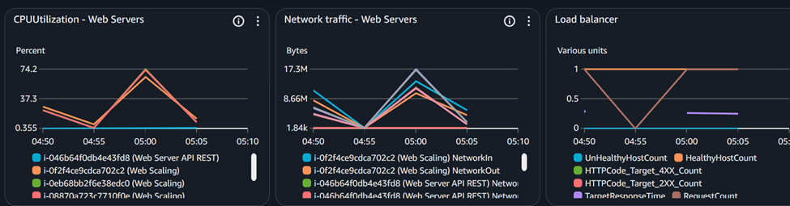

# Análisis de Capacidad — Entrega 3

---

## Objetivo General

Evaluar la **capacidad máxima y estabilidad** del sistema bajo condiciones de carga progresivas, identificando:

- El **punto de saturación** de la capa web (usuarios concurrentes)
- La **capacidad del worker** para procesamiento de videos (videos/minuto)
- La **degradación del tiempo de respuesta** bajo cargas crecientes
- Los **recursos críticos** (CPU, memoria, red, I/O)

---

## Infraestructura Evaluada

| Componente | Especificación | Función |
|------------|----------------|---------|
| **Load Balancer** | AWS ELB Application | Distribución de tráfico HTTP |
| **Web API (x2)** | EC2 t3.micro (2 vCPU, 1 GB RAM) | FastAPI + Uvicorn |
| **Worker** | EC2 t3.medium (2 vCPU, 4 GB RAM) | Celery + FFmpeg |
| **Base de Datos** | RDS PostgreSQL db.t3.micro | Metadatos y estado |
| **Message Broker** | RabbitMQ en EC2 | Cola de tareas asíncronas |
| **Storage** | Amazon S3 | Almacenamiento de videos |
| **Monitoreo** | AWS CloudWatch | Métricas y alarmas |

---

# Capacidad de la Capa Web (Usuarios Concurrentes)

---

## Objetivo del Escenario

Para esta prueba no se considera el tiempo de procesamiento en el worker, solo se quiere medir la capacidad de la capa web y se asume que el endpoint responde instantaneamente.

Determinar el número máximo de **usuarios concurrentes** que la API de subida soporta cumpliendo los SLOs:
- **p95 de endpoints de carga** ≤ 1 segundo
- **Tasa de error (4xx/5xx)** ≤ 5%
- Sin **resets, timeouts** o **throttling** del almacenamiento

---

## Configuración de la Prueba

| Parámetro | Valor |
|-----------|-------|
| **Herramienta** | Apache JMeter 5.6 |
| **Tipo de prueba** | Stress Test (Ramp-up incremental) |
| **Estrategia de carga** | Incrementos de 100 usuarios por prueba |
| **Pasos de carga** | 100 → 200 → 300 → 400 → 500 → 600 → 700 usuarios |
| **Ramp-up por prueba** | 180 segundos |
| **Hold time por prueba** | 300 segundos |
| **Tiempo total por prueba** | 480 segundos |
| **Prueba sostenida** | 480 usuarios (80% de 600) durante 5 minutos |
| **Timeout** | 30 segundos |
| **Keep-Alive** | Habilitado |

---

## Resultados por Fase de Carga

### Smoke Test (Validación Inicial)

**Objetivo:** Verificar que el sistema responde correctamente antes de iniciar pruebas de carga.

**Metricas baseline en CloudWatch**

| Métrica | Resultado |
|---------|-----------|
| **Usuarios** | 5 |
| **Requests totales** | 545 |
| **Tasa de error** | 0% |
| **Tiempo promedio (ms)** | 104ms |
| **p95 (ms)** | 151ms |
| **Throughput (req/s)** | 9.2 |

**Observación:** Sistema estable, sin errores. Base de datos responde normalmente.

---

### Ramp-up con 100 Usuarios

| Requests totales | Tiempo Promedio (ms) | p95 (ms) | Throughput (req/s) | Error % |
|------------------|---------------------|----------|-------------------|---------|
| 56477 | 288 | 570 | 117.7 | 0% |

**Análisis:**  
Sistema responde establemente. Sin degradación visible. CPU y memoria dentro de rangos normales. Una sola instancia activa

---

- Continuamos aumentando los usuarios concurrentes de 100 en 100 hasta llegar a los puntos criticos.

### Ramp-up con 600 Usuarios (Punto Crítico)

| Requests totales | Tiempo Promedio (ms) | p95 (ms) | Throughput (req/s) | Error % |
|------------------|---------------------|----------|-------------------|---------|
| 294865 | 392 | 834 | 614.3 | 0.02% |

**Análisis:**  
**Último punto estable antes de la falla.** P95 en el límite del SLO. Vemos que el uso de CPU sube pero para estas cargas ya se activa el autoscaling, por lo que el CPU de cada una de las instancias esta menos saturado que una sola instancia corriendo 100 usuarios concurrentes. Tasa de error muy baja pero algunos errores esporadicos. 

---

### Ramp-up con 700 Usuarios (Punto de Falla)

| Requests totales | Tiempo Promedio (ms) | p95 (ms) | Throughput (req/s) | Error % |
|------------------|---------------------|----------|-------------------|---------|
| 333832 | 415 | 1007 | 695.2 | 0.03% |

**Análisis:**  
**Sistema colapsado.** P95 supera muy ligeramente 1 segundo. Tasa de error sigue siendo muy baja aunque los tiempos de respuestas ya se esten viendo degradados. CPU saturado (>90%) para las 3 instancias monitoreadas. trafico de red alcanza niveles muy altos.

**Conclusión:**  
**Punto de saturación alcanzado.** El sistema empieza a violar los SLOs cuando se acerca a los 700 usuarios concurrentes.
**Capacidad máxima sostenible: ~600 usuarios concurrentes** con cumplimiento marginal de SLOs.
**Cuello de botella: uso de CPU en las instancias** Con 700 usuarios concurrentes la CPU de las tres instancias se satura por encima de 90% de capacidad, afectando el rendimiento y los tiempos de respuesta.

---

### Prueba Sostenida con 480 Usuarios (80% de 600)

**Objetivo:** Validar estabilidad a largo plazo en carga sostenida al 80% de la capacidad máxima.

| Parámetro | Valor |
|-----------|-------|
| **Usuarios concurrentes** | 480 |
| **Ramp-up** | 60 segundos |
| **Hold time** | 240 segundos |
| **Tiempo total** | 300 segundos |

**Duración:** 5 minutos

| Momento | Requests totales | Tiempo Promedio (ms) | p95 (ms) | Throughput (req/s) | Error % |
|---------|------------------|---------------------|----------|-------------------|---------|
| Minuto 1 | 30412 | 286 | 709 | 412.5 | 0% |
| Minuto 5 | 156300 | 425 | 762 | 521.0 | 0.02% |

**Análisis:**  
Sistema **estable** durante 5 minutos continuos, p95 no muestra un gran cambio con los usuarios concurrentes. Sin degradación progresiva. SLOs cumplidos. No hay evidencia de memory leaks ni saturación de conexiones. Se genera un porcentaje minimo de errores esporadicos en la parte sostenida. Las 3 instancias estan activas con un porcentaje de uso de CPU que, aunque no es critico, esta cerca de su capacidad maxima, hay un poco de capacidad disponible en caso de picos de carga.

**Conclusión:**  
**Capacidad sostenible recomendada: 480 usuarios concurrentes** (80% de capacidad máxima) con margen de seguridad del 20% para picos transitorios.

---

## Resumen — Capacidad de la Capa Web

| Métrica | Valor |
|---------|-------|
| **Capacidad máxima experimental** | 600 usuarios concurrentes |
| **Capacidad sostenible (recomendada)** | 480 usuarios concurrentes (80% de máxima) |
| **Punto de falla** | 700 usuarios concurrentes |
| **p95 en capacidad sostenible** | 762 ms |
| **Throughput máximo sostenido** | 521.0 req/s |
| **Tasa de error en capacidad sostenible** | 0.02% |
| **Recurso crítico** | CPU del servidor API |

**Análisis:**  
No hay una correlacion entre los usuarios concurrentes y el porcentaje de errores, lo que indica que la aplicacion no esta fallando con el aumento de carga sino solo se degrada el rendimiento para estas magnitudes de carga. 
---

# Conclusiones Generales

---

## Fortalezas del Sistema

-  **Arquitectura estable** bajo carga progresiva hasta 600 usuarios
-  **Sin memory leaks** detectados durante pruebas sostenidas

---

## Debilidades Detectadas

-  **CPU saturado** en servidores API con >600 usuarios

---

## Recomendaciones Técnicas

| Área | Mejora Sugerida | Impacto Esperado |
|------|-----------------|------------------|
| **Web app** | Escalar horizontalmente a mas instancias EC2 t3.small | +100% capacidad |
| **Load Balancer** | Validar health checks y timeout configuration | Reducir 502/504 |
| **Worker** | Aumentar concurrency de Celery: `--concurrency=4` | +100-200% videos/min |
| **Observabilidad** | Integrar Prometheus + Grafana para métricas en tiempo real | Mejor visibilidad |

---
