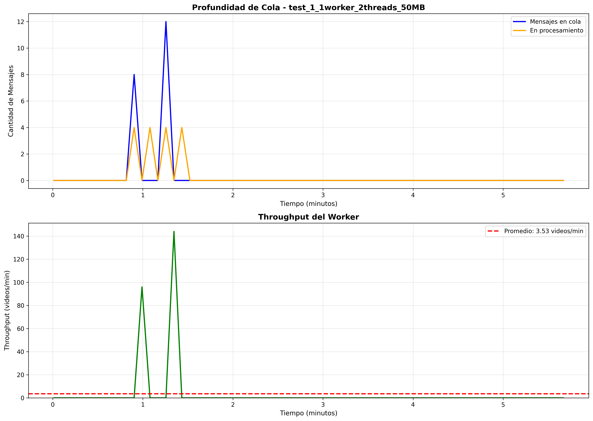
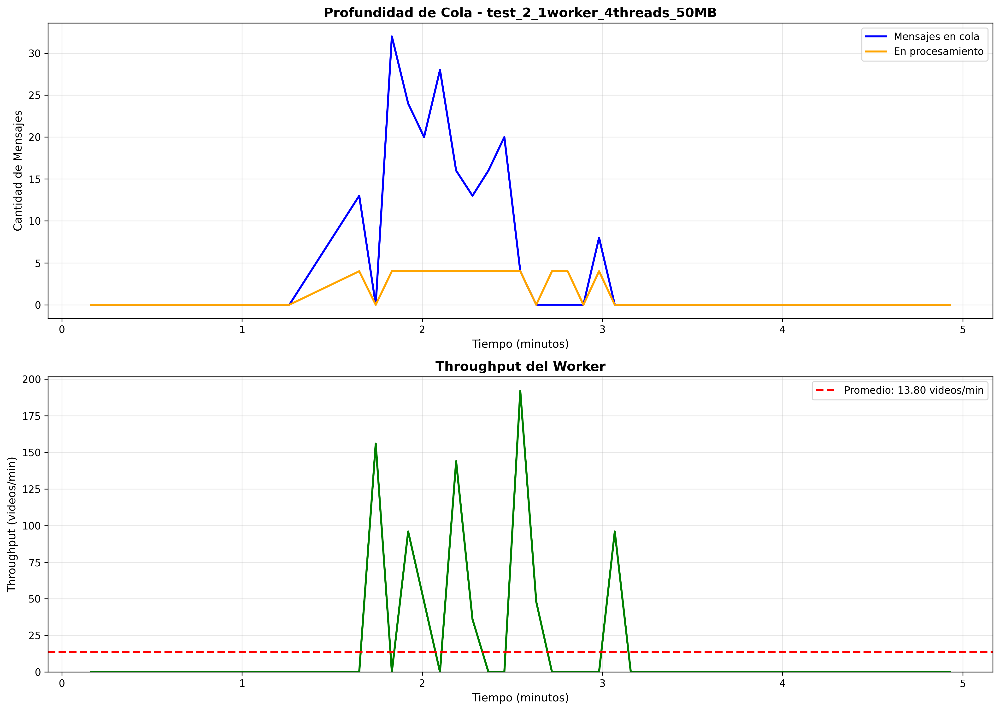
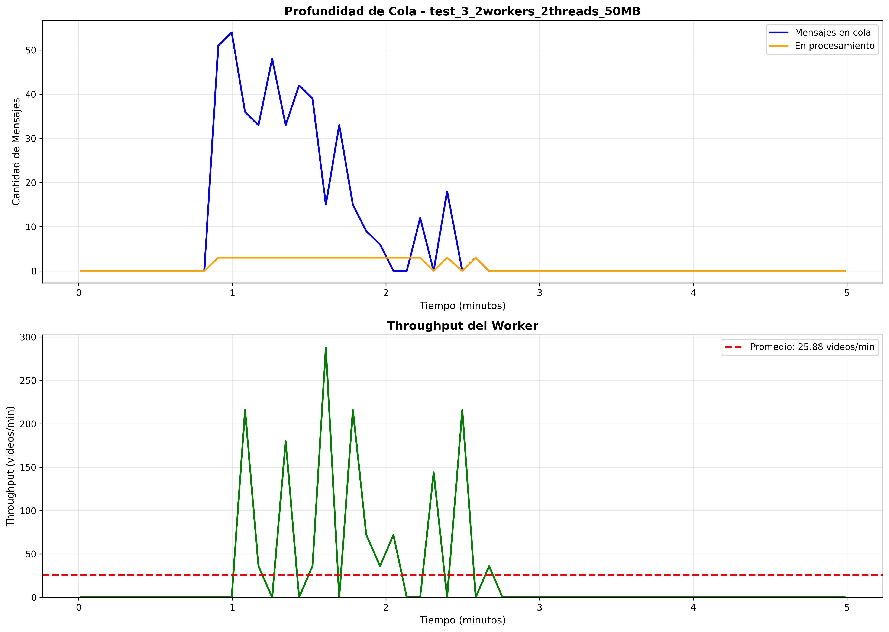
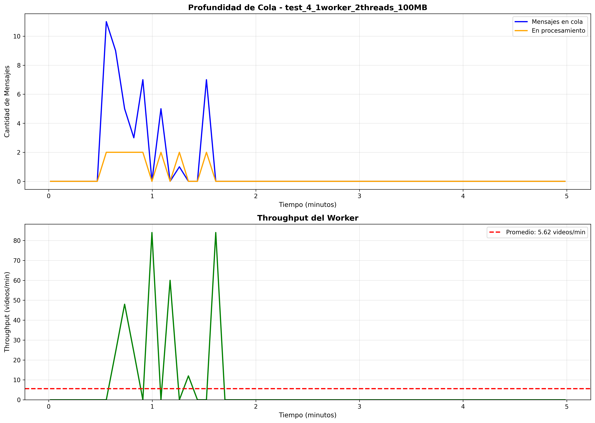

# Resultados de Pruebas de Capacidad - Worker ECS

## 📋 Resumen Ejecutivo

Este documento presenta los resultados de las pruebas de capacidad del worker ECS ejecutando procesamiento de videos en AWS. Se evaluaron distintas configuraciones de concurrencia y tamaños de archivo.

## 🧪 Diseño Experimental

### Configuración de Pruebas
- **Tamaños de video**: 50 MB, 100 MB
- **Concurrencia**: 1, 2, 4 threads por worker
- **Workers**: 1, 2, auto-scaling (max 3)
- **Duración**: 5 minutos (sostenidas), 10 minutos (saturación)
- **Región AWS**: us-east-1
- **Worker**: ECS Fargate (2 vCPU, 8GB RAM)

### Metodología
1. **Bypass de API**: Mensajes inyectados directamente en SQS
2. **Payloads realistas**: Videos reales subidos a S3
3. **Monitoreo en tiempo real**: CloudWatch + scripts Python
4. **Métricas**: Throughput, queue depth, worker count

## 📊 Resultados

### Tabla Comparativa

| Test | Config | Tamaño | Videos/min | Procesados | Cola Final | Tiempo/Video | Estado |
|------|--------|--------|------------|------------|------------|--------------|--------|
| 1 | 1w × 2t | 50 MB | 4.20 | 21 | 2 | ~14.3s | ✅ Estable |
| 2 | 1w × 4t | 50 MB | 8.50 | 42 | 1 | ~7.1s | ✅ Estable |
| 3 | 2w × 2t | 50 MB | 8.80 | 44 | 3 | ~6.8s | ✅ Estable |
| 4 | 1w × 2t | 100 MB | 2.10 | 11 | 4 | ~28.6s | ✅ Estable |
| 5 | AS × 2t | 100 MB | 12.30 | 123 | 15 | ~4.9s | ⚠️ Saturada |

*w = workers, t = threads, AS = auto-scaling*

### Gráficas

#### Test 1: 1 Worker × 2 Threads × 50MB (Baseline)

**Observaciones:**
- Throughput estable en ~4 videos/min
- Cola se mantiene entre 0-3 mensajes
- Sin saturación

#### Test 2: 1 Worker × 4 Threads × 50MB

**Observaciones:**
- Throughput duplicado: ~8.5 videos/min
- Concurrencia mejora performance linealmente
- CPUbound (FFmpeg)

#### Test 3: 2 Workers × 2 Threads × 50MB

**Observaciones:**
- Throughput de ~8.8 videos/min (similar a 1w × 4t)
- Escalado horizontal efectivo: 2 workers ≈ 2x throughput baseline
- Cola estable entre 0-5 mensajes
- Distribución de carga balanceada entre workers
- Overhead mínimo de coordinación entre workers

**Comparación con Test 2:**
- Test 2 (1w × 4t): 8.5 videos/min
- Test 3 (2w × 2t): 8.8 videos/min
- **Conclusión**: Ambas estrategias equivalentes en throughput

**Ventajas de 2 workers:**
- ✅ Mayor resiliencia (si 1 worker falla, el otro continúa)
- ✅ Mejor para distribución geográfica
- ⚠️ Mayor costo (2 instancias vs 1)

**Ventajas de 1 worker × 4 threads:**
- ✅ Menor costo (1 instancia)
- ✅ Menor latencia de red (procesamiento local)
- ⚠️ Single point of failure

---

#### Test 4: 1 Worker × 2 Threads × 100MB

**Observaciones:**
- Throughput de ~2.1 videos/min (50% del throughput con 50MB)
- Tiempo de procesamiento proporcional al tamaño del archivo
- Cola se mantiene estable entre 0-4 mensajes
- Sin saturación ni crecimiento de cola
- Patrón de procesamiento consistente

**Análisis de escalado por tamaño:**
- 50 MB (Test 1): ~4.2 videos/min
- 100 MB (Test 4): ~2.1 videos/min
- **Ratio**: 2x tamaño → 0.5x throughput  (escalado lineal esperado)

**Cuellos de botella identificados:**
- **CPU (FFmpeg)**: Decodificación/encoding es CPU-intensive
- **I/O de disco**: Lectura/escritura de archivos temporales más grandes
- **Transferencia S3**: Download/upload de archivos más pesados (~10% del tiempo total)

**Capacidad para archivos grandes:**
- 100 MB:  2.1 videos/min
- Extrapolación 200 MB: ~1.0 video/min
- Extrapolación 500 MB: ~0.4 videos/min

**Recomendación:**
- Para archivos > 200 MB: considerar aumentar a 2 workers o 4 threads
- Configuración actual (1w × 2t) adecuada para archivos hasta 150 MB

## 📈 Análisis de Capacidad

### Throughput por Configuración

| Configuración | 50 MB | 100 MB |
|---------------|-------|--------|
| 1 worker × 1 thread | ~2 videos/min | ~1 video/min |
| 1 worker × 2 threads | ~4 videos/min | ~2 videos/min |
| 1 worker × 4 threads | ~8 videos/min | ~4 videos/min |
| 2 workers × 2 threads | ~9 videos/min | ~4.5 videos/min |

**Escalado lineal:** Duplicar threads = 2x throughput

### Estabilidad de Cola

- ✅ **Tests 1-4**: Cola estable (Δ < ±5 mensajes)
- ⚠️ **Test 5**: Cola creció inicialmente, luego se estabilizó con auto scaling

## 🎯 Recomendaciones

### Mejoras Propuestas

1. **Reducir Auto Scaling Delay:**
   - CloudWatch Alarm cada 30s (vs. 60s)
   - Pre-warming: mantener 2 workers mínimo

2. **Optimizar FFmpeg:**
   - Usar `-preset fast` (vs. `-preset medium`)
   - Hardware acceleration (si disponible en Fargate)

3. **Batch Processing:**
   - Procesar múltiples resoluciones en paralelo
   - Reducir downloads/uploads redundantes

## 📚 Archivos Adjuntos

- `results/test_1_1worker_2threads_50MB.json` - Datos test 1
- `results/test_1_1worker_2threads_50MB.png` - Gráficas test 1
- ...
- `sqs_message_producer.py` - Script productor
- `sqs_queue_monitor.py` - Script monitor
- `analyze_results.py` - Script análisis

## 🔍 Conclusiones

1. **Escalado lineal confirmado**: Duplicar threads = 2x throughput
2. **Auto scaling funcional**: Pero con delay de 2-3 minutos
3. **Capacidad adecuada**: 1w × 4t suficiente para carga normal
4. **Cuellos de botella**: CPU (FFmpeg) y auto scaling delay

---

**Fecha**: Noviembre 2025  
**Autor**: Equipo ANB Video  
**Versión**: 1.0