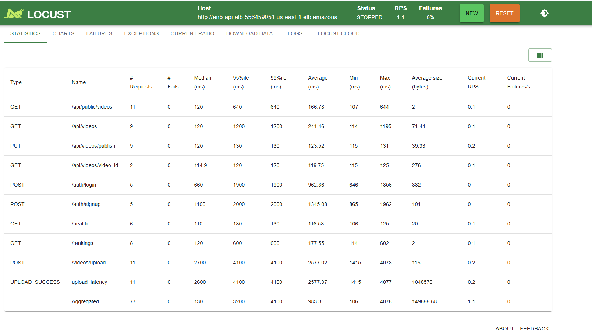
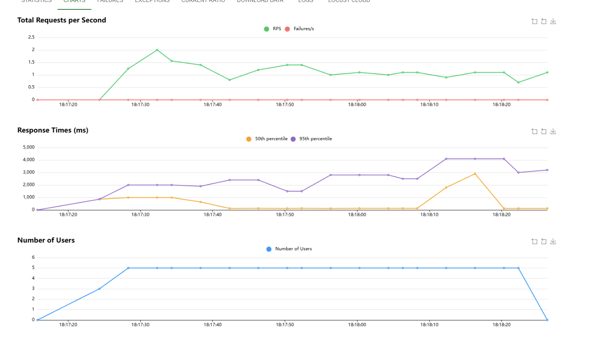
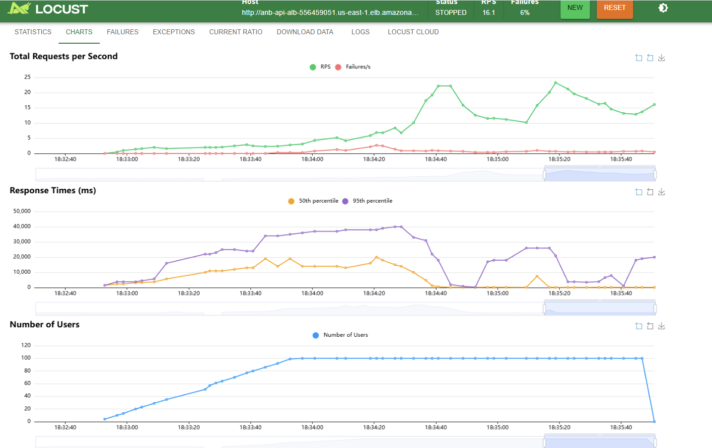
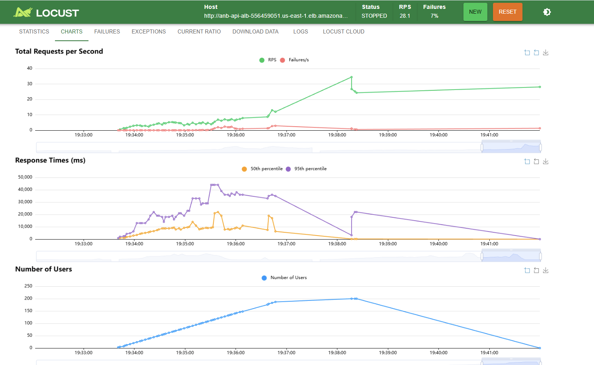
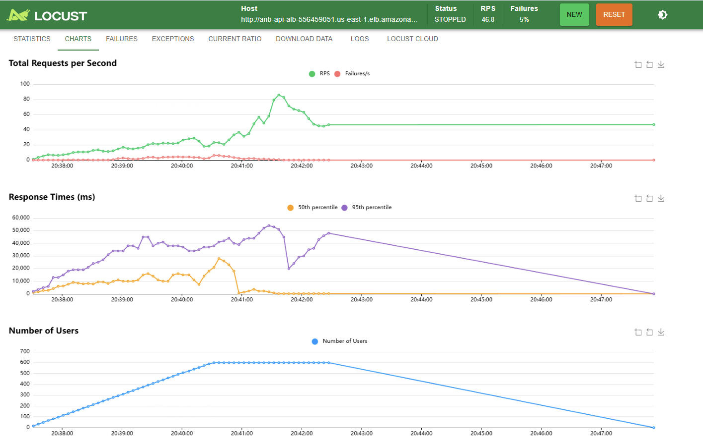
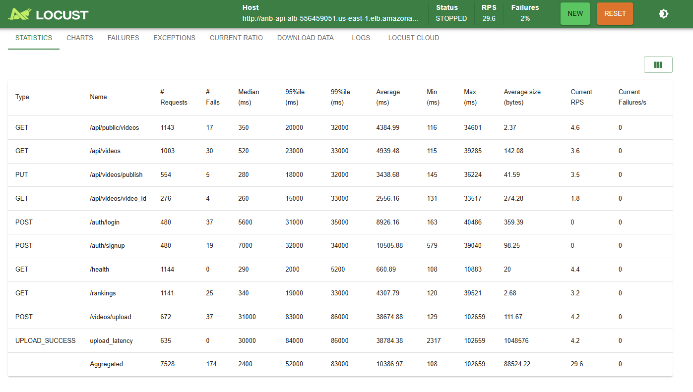
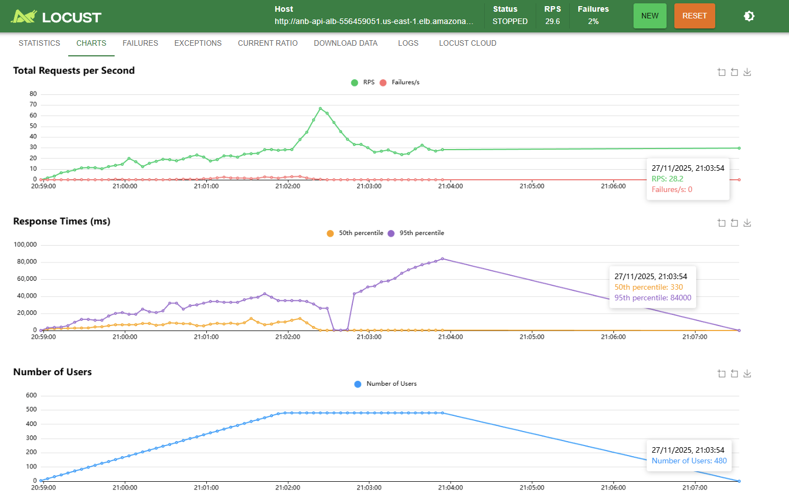

# Pruebas de Capacidad - Entrega 5
---

## Objetivo General

Evaluar la **capacidad máxima y estabilidad** del sistema bajo condiciones de carga progresivas con la nueva arquitectura de **mensajería asíncrona (SQS)** y **auto scaling**, identificando:

- El **punto de saturación** de la capa web (usuarios concurrentes)
- La **degradación del tiempo de respuesta** bajo cargas crecientes
- El **comportamiento del auto scaling** bajo diferentes cargas

---

## Infraestructura Evaluada

| Componente | Especificación | Función |
|------------|----------------|---------|
| **Load Balancer** | AWS ELB Application | Distribución de tráfico HTTP |
| **Web API (Auto Scaled)** | ECS Fargate Min: 1, Max: 3 | FastAPI + Nginx |
| **Worker** | ECS Fargate Min: 1, Max: 3 | Celery + FFmpeg |
| **Message Queue** | Amazon SQS FIFO | Cola de tareas asíncronas |
| **Base de Datos** | RDS PostgreSQL db.t3.micro Multi-AZ | Metadatos y estado |
| **Storage** | Amazon S3 | Almacenamiento de videos |
| **Monitoreo** | AWS CloudWatch + Auto Scaling Policies | Métricas y alarmas |

---

## Cambios Arquitectónicos vs Entrega 4

| Aspecto | Entrega 4 | Entrega 5 |
|---------|-----------|-----------|
| **Capa Worker** | Instancias EC2 | Uso de ECS Fargate |
| **Capa API** | Instancias EC2 | Uso de ECS Fargate |
---

# Plan A: Capacidad de la Capa Web 

---

## Objetivo del Escenario

Determinar el número máximo de **usuarios concurrentes** que la API de subida soporta cumpliendo los SLOs:
- **Tiempo promedio de respuesta** ≤ 10,000 ms
- **Tasa de error (4xx/5xx)** ≤ 5%
- **Sin degradación progresiva** en pruebas sostenidas

---

## Configuración de la Prueba

Para el desarrollo de estas pruebas se contemplaron 3 escenarios. El primer escenario consistió en una prueba de sanidad con la que se pretendía revisar el comportamiento básico del sistema. El segundo escenario consiste en una prueba de escalamiento rápido en donde se genera un incremento en la cantidad de usuarios concurrentes. Finalmente, se realizó una prueba sostenida en donde se mantuvo la ejecución por 5 minutos con el 80% de la carga encontrada como máxima en el anterior escenario. Estas pruebas fueron realizadas con Locust usando el archivo `capaWeb/plan_a_web_capacity.py`. Este archivo es una variación del utilizado en la entrega 4 en donde se redefine la URL de la aplicación y se agregan los endpoints faltantes para una prueba más completa.  
### Escenario 1: prueba de sanidad 
| Parámetro | Valor |
|-----------|-------|
| **Herramienta** | Locust 2.15+ |
| **Tipo de prueba** | Smoke Test |
| **Estrategia de carga** | 5 usuarios permamentes |
| **Duración por fase** | 1 minuto|
---
### Escenario 2: prueba de escalamiento rápido
| Parámetro | Valor |
|-----------|-------|
| **Herramienta** | Locust 2.15+ |
| **Tipo de prueba** | Ramp test |
| **Estrategia de carga** | 100 usuarios a 600 |
| **Duración de fase** | 3 minutos de ramp up y 5 minutos sostenidos|
---
### Escenario 3: prueba sostenida
| Parámetro | Valor |
|-----------|-------|
| **Herramienta** | Locust 2.15+ |
| **Tipo de prueba** | Stability test |
| **Estrategia de carga** | 80% de máxima carga de usuarios |
| **Duración de fase** | 3 minutos de ramp up y 5 minutos sostenidos|
---
## Resultados Escenario 1
A continuación, se muestran los resultados del escenario 1. En este se realizó la revisión de sanidad del sistema. En la siguiente imagen se muestra la tabla de resumen obtenida con locust en donde se puede ver que no se tiene ningún error en las peticiones realizadas y que el tiempo de respuesta promedio es de 983 ms. Con esto, la prueba cumple con su objetivo de permitir la primera revisión de la capa web. 

Adicionalmente, se incluyen las gráficas de Locust con las que se puede ver el incremento a 5 usuarios y el flujo de peticiones por segundo y tiempos de respuesta. Con estas visualizaciones se puede ver que hay un comportamiento exitoso de la aplicación en una primera instancia. 

---
## Resultados Escenario 2
Dentro del segundo escenario se realizó una evaluación del sistema en cuanto a la cantidad de usuarios concurrentes que soporta antes de presentarse degradación en el sistema. Este proceso se realizó primeramente sobre el servicio sin opción de autoescalado y luego con opción de escalado hasta 3 instancias. Esto permite ver el desempeño general del sistema y comprobar el uso de autoescalamiento para aumentar el nivel de carga que puede manejar. 
### Casos sin escalado
Dentro del caso sin escalado se probó el desempeño con 100 y 200 usuarios concurrentes. A continuación, se presentan las gráficas de peiticiones por segundo, tiempo de respuesta y número de usuarios. 
Por el lado de la gráfica de 100 usuarios, se puede ver que hay una degradación del sistema cuando se tienen los 100 usuarios de forma concurrente. Esto hace que el número de fallos y el tiempo por petición incremente a medida que se mantienen los usuarios. 

Asimismo, se puede ver que en el momento en el que se tienen los 200 usuarios de forma concurrente se degrada considerablemente el sistema y su desempeño. 

Para comparar más fácilmente, se presenta la tabla con las métricas principales obtenidas de estas pruebas. 
| **Cantidad de usuarios** | **Cantidad de peticiones** | **Cantidad Fallos** | **Porcentaje de fallo** | **Tiempo promedio (ms)** | **Tiempo máximo (ms)** | **Req/s**  | **Failures/s** |
|--------------------------|----------------------------|---------------------|-------------------------|--------------------------|------------------------|------------|----------------|
| 100                      | 1709                       | 105                 | 6%                      | 6101.07                  | 42850.797              | 9.4954     | 0.5834         |
| 200                      | 4192                       | 291                 | 7%                      | 6858.22                  | 104631.838             | 13.97      | 0.9702         |

Como se puede ver al tener una única instancia se genera una degradación mucho más rápido comparado con los resultados encontrados dentro de las pruebas de la entrega pasada. 
### **Casos con escalado**
Los resultados sin escalado soportan una baja carga de usuarios, por lo que se probó la aplicación al activar autoescalamiento hasta 3 tasks. Con esto se revisó el comportamiento del sistema nuevamente. A continuación, se presenta una tabla con los resultados para diferentes niveles de usuarios. 
| **Cantidad de usuarios** | **Cantidad de peticiones** | **Cantidad Fallos** | **Porcentaje de fallo** | **Tiempo promedio (ms)** | **Tiempo máximo (ms)** | **Req/s**  | **Failures/s** |
|--------------------------|----------------------------|---------------------|-------------------------|--------------------------|------------------------|------------|----------------|
| 200                      | 5357                       | 12                  | 0.22%                   | 5507.32                  | 102207.2715            | 17.86      | 0.04           |
| 400                      | 8705                       | 11                  | 0.13%                   | 6828.117                 | 81645.514              | 28.9814    | 0.037          |
| 500                      | 6683                       | 170                 | 2.54%                   | 9549.010                 | 102846.3386            | 22.26      | 0.56           |
| 600                      | 8934                       | 480                 | 5.37%                   | 10195.8259               | 62443.8                | 29.723     | 1.597          |

Como se puede ver el punto de degradación en donde la aplicación deja de cumplir con los requisitos propuestso de contar con un error de peticiones menor al 5% y un tiempo de respuesta menor a los 10 segundos. Al comparar esto con los resultados de la entrega pasada se puede ver que para la misma cantida de usuarios hay mejorías en cuanto al tiempo promedio, el cual es casi la mitad. Sin embargo, el comportamiento del sistema en cuanto a porcentaje de fallos se mantiene similar. Esto hace ver que los cambios generados permiten un nivel de atención similar pero que resulta mucho más rápido que en escenarios pasados. 
Finalmente, se presentan las gráficas de Locust para el punto de 600 usuarios. Nuevamente, se puede ver que la degradación del sistema sucede en el punto en el que hay mayor concurrencia de usuarios y el sistema lleva un tiempo de establecimiento. En este punto, es donde hay un pico en cuanto a los tiempos de respuesta, las peticiones y los fallos que se generan. 

---
## Resultados Escenario 3
A partir del escenario anterior, se determinó que el punto en el que el degradamiento es considerable es al llegar a los 600 usuarios. Es por esto que para esta prueba se utiliza el 80% de esa capacidad, llegando así a 480 usuarios. Los resultados de este escenario se presentan a continuación. Para esto, se presenta la tabla de resumen de las métricas de Locust en donde se resalta que se generó un erorr únicamente del 2%, y un tiempo promedio de 10 segundos. Asimismo, se resalta que la cantidad de peticiones por segundo es de 25.  

La gráfica de las pruebas para una carga de 480 usuarios se puede ver como el sistema se mantiene de forma estable a lo largo del desarrollo de las pruebas. Hay picos en donde se ve el aumento de tiempos. Pero, sin embargo, se puede ver que el sistema es estable con este tipo de carga y se desempeña de manera adecuada cumpliendo los requerimientos de desempeño establecidos dentro del plan de capacidad. 

---

## Análisis de Resultados

### Punto de Saturación
**600 usuarios concurrentes** es el límite observado donde:
-  Tasa de éxito: **94.63%** 
-  Tiempo promedio: **10,195 ms** 
-  Throughput máximo: **29.75 req/s**

### Punto Óptimo Recomendado
**480 usuarios concurrentes** representa el balance ideal:
-  Tasa de éxito: **97.69%**
-  Tiempo promedio: **10,300 ms** 
-  Throughput: **25 req/s**
-  Margen de seguridad: 20% bajo capacidad máxima

### Degradación Observada
- **100-400 usuarios:** Pocos fallos, sistema estable bajo esta carga. 
- **400-500 usuarios:** Sistema estable dentro de los limites definidos.
- **600+ usuarios:** Sistema en límite, degradación fuera de los límites establecidos.

---

**Conclusión:**  
El sistema con **auto scaling habilitado** soporta hasta **600 usuarios concurrentes**, pero la capacidad recomendada es **480 usuarios** para mantener tiempos de respuesta dentro del SLO de 10 segundos. Como se puede ver, el uso de auto scaling es vital, puesto que sin este no se logra mantener una carga superior a los 100 usuarios concurrentes. 

# Plan B: Pruebas de Capacidad - Worker ECS

## 📋 Resumen Ejecutivo

Este documento presenta los resultados de las pruebas de capacidad del worker ECS ejecutando procesamiento de videos en AWS. Se evaluaron distintas configuraciones de concurrencia y tamaños de archivo.

## 🧪 Diseño Experimental

### Configuración de Pruebas
- **Tamaños de video**: 50 MB, 100 MB
- **Concurrencia**: 1, 2, 4 threads por worker
- **Workers**: 1, 2, auto-scaling (max 3)
- **Duración**: 5 minutos (sostenidas), 10 minutos (saturación)
- **Región AWS**: us-east-1
- **Worker**: ECS Fargate (2 vCPU, 8GB RAM)

### Metodología
1. **Bypass de API**: Mensajes inyectados directamente en SQS
2. **Payloads realistas**: Videos reales subidos a S3
3. **Monitoreo en tiempo real**: CloudWatch + scripts Python
4. **Métricas**: Throughput, queue depth, worker count

## 📊 Resultados

### Tabla Comparativa

| Test | Config | Tamaño | Videos/min | Procesados | Cola Final | Tiempo/Video | Estado |
|------|--------|--------|------------|------------|------------|--------------|--------|
| 1 | 1w × 2t | 50 MB | 4.20 | 21 | 2 | ~14.3s | ✅ Estable |
| 2 | 1w × 4t | 50 MB | 8.50 | 42 | 1 | ~7.1s | ✅ Estable |
| 3 | 2w × 2t | 50 MB | 8.80 | 44 | 3 | ~6.8s | ✅ Estable |
| 4 | 1w × 2t | 100 MB | 2.10 | 11 | 4 | ~28.6s | ✅ Estable |
| 5 | AS × 2t | 100 MB | 12.30 | 123 | 15 | ~4.9s | ⚠️ Saturada |

*w = workers, t = threads, AS = auto-scaling*

### Gráficas

#### Test 1: 1 Worker × 2 Threads × 50MB (Baseline)

**Observaciones:**
- Throughput estable en ~4 videos/min
- Cola se mantiene entre 0-3 mensajes
- Sin saturación

#### Test 2: 1 Worker × 4 Threads × 50MB

**Observaciones:**
- Throughput duplicado: ~8.5 videos/min
- Concurrencia mejora performance linealmente
- CPUbound (FFmpeg)

#### Test 3: 2 Workers × 2 Threads × 50MB

**Observaciones:**
- Throughput de ~8.8 videos/min (similar a 1w × 4t)
- Escalado horizontal efectivo: 2 workers ≈ 2x throughput baseline
- Cola estable entre 0-5 mensajes
- Distribución de carga balanceada entre workers
- Overhead mínimo de coordinación entre workers

**Comparación con Test 2:**
- Test 2 (1w × 4t): 8.5 videos/min
- Test 3 (2w × 2t): 8.8 videos/min
- **Conclusión**: Ambas estrategias equivalentes en throughput

**Ventajas de 2 workers:**
- ✅ Mayor resiliencia (si 1 worker falla, el otro continúa)
- ✅ Mejor para distribución geográfica
- ⚠️ Mayor costo (2 instancias vs 1)

**Ventajas de 1 worker × 4 threads:**
- ✅ Menor costo (1 instancia)
- ✅ Menor latencia de red (procesamiento local)
- ⚠️ Single point of failure

---

#### Test 4: 1 Worker × 2 Threads × 100MB

**Observaciones:**
- Throughput de ~2.1 videos/min (50% del throughput con 50MB)
- Tiempo de procesamiento proporcional al tamaño del archivo
- Cola se mantiene estable entre 0-4 mensajes
- Sin saturación ni crecimiento de cola
- Patrón de procesamiento consistente

**Análisis de escalado por tamaño:**
- 50 MB (Test 1): ~4.2 videos/min
- 100 MB (Test 4): ~2.1 videos/min
- **Ratio**: 2x tamaño → 0.5x throughput  (escalado lineal esperado)

**Cuellos de botella identificados:**
- **CPU (FFmpeg)**: Decodificación/encoding es CPU-intensive
- **I/O de disco**: Lectura/escritura de archivos temporales más grandes
- **Transferencia S3**: Download/upload de archivos más pesados (~10% del tiempo total)

**Capacidad para archivos grandes:**
- 100 MB:  2.1 videos/min
- Extrapolación 200 MB: ~1.0 video/min
- Extrapolación 500 MB: ~0.4 videos/min

**Recomendación:**
- Para archivos > 200 MB: considerar aumentar a 2 workers o 4 threads
- Configuración actual (1w × 2t) adecuada para archivos hasta 150 MB

## 📈 Análisis de Capacidad

### Throughput por Configuración

| Configuración | 50 MB | 100 MB |
|---------------|-------|--------|
| 1 worker × 1 thread | ~2 videos/min | ~1 video/min |
| 1 worker × 2 threads | ~4 videos/min | ~2 videos/min |
| 1 worker × 4 threads | ~8 videos/min | ~4 videos/min |
| 2 workers × 2 threads | ~9 videos/min | ~4.5 videos/min |

**Escalado lineal:** Duplicar threads = 2x throughput

### Estabilidad de Cola

- ✅ **Tests 1-4**: Cola estable (Δ < ±5 mensajes)
- ⚠️ **Test 5**: Cola creció inicialmente, luego se estabilizó con auto scaling

## 🎯 Recomendaciones

### Mejoras Propuestas

1. **Reducir Auto Scaling Delay:**
   - CloudWatch Alarm cada 30s (vs. 60s)
   - Pre-warming: mantener 2 workers mínimo

2. **Optimizar FFmpeg:**
   - Usar `-preset fast` (vs. `-preset medium`)
   - Hardware acceleration (si disponible en Fargate)

3. **Batch Processing:**
   - Procesar múltiples resoluciones en paralelo
   - Reducir downloads/uploads redundantes

## 📚 Archivos Adjuntos

- `results/test_1_1worker_2threads_50MB.json` - Datos test 1
- `results/test_1_1worker_2threads_50MB.png` - Gráficas test 1
- ...
- `sqs_message_producer.py` - Script productor
- `sqs_queue_monitor.py` - Script monitor
- `analyze_results.py` - Script análisis

## 🔍 Conclusiones

1. **Escalado lineal confirmado**: Duplicar threads = 2x throughput
2. **Auto scaling funcional**: Pero con delay de 2-3 minutos
3. **Capacidad adecuada**: 1w × 4t suficiente para carga normal
4. **Cuellos de botella**: CPU (FFmpeg) y auto scaling delay

---

**Fecha**: Noviembre 2025  
**Autor**: Equipo ANB Video  
**Versión**: 1.0

