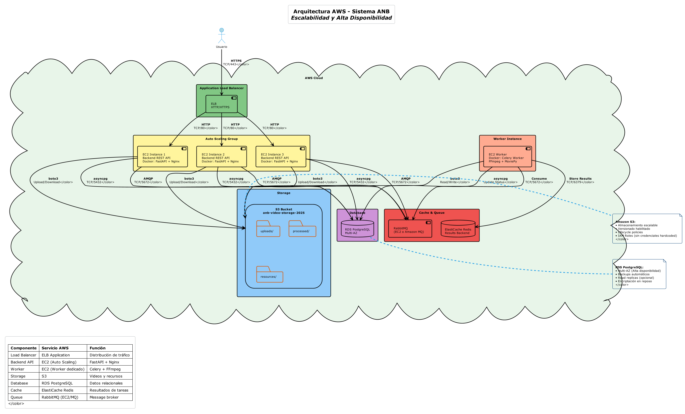
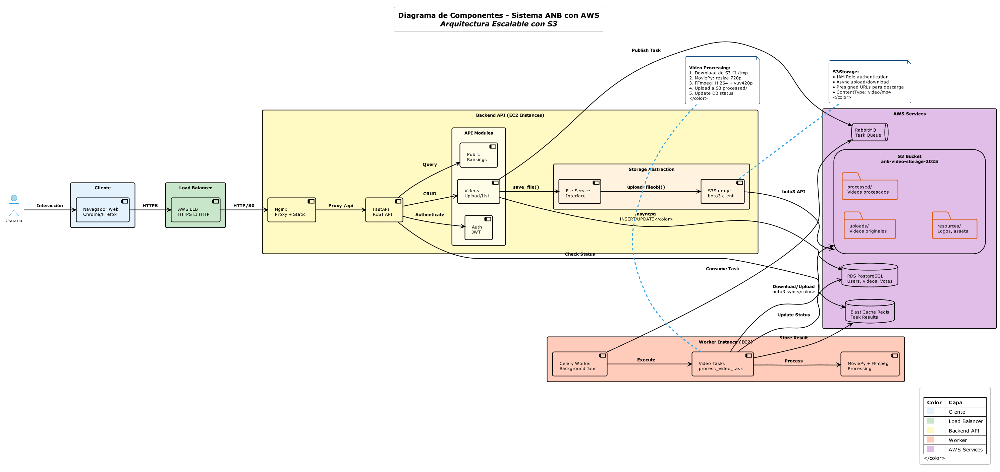
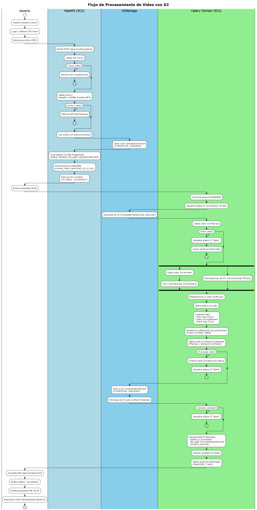
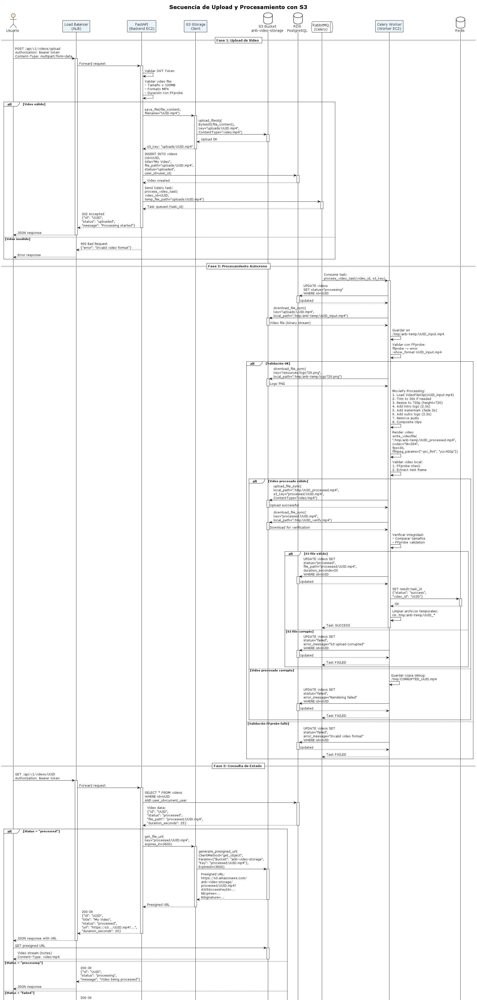

# Entrega 3 - ANB Video Platform en AWS

## 📋 Descripción General

Migración completa de la plataforma ANB Video a **Amazon Web Services (AWS)**, implementando una arquitectura escalable y de alta disponibilidad. Se reemplazó el almacenamiento NFS por **Amazon S3**, se incorporó **Auto Scaling** para el backend, y se separó el procesamiento en un **Worker dedicado** en EC2.

---

## 🎯 Cambios Principales vs. Entrega 1

| Aspecto | Entrega 2 (NFS) | Entrega 3 (AWS + S3) |
|---------|-----------------|----------------------|
| **Almacenamiento** | NFS compartido entre VM | Amazon S3 (buckets separados) |
| **Backend** | 1 instancia EC2 | Auto Scaling Group (2-5 instancias) |
| **Load Balancing** | No implementado | Application Load Balancer (ALB) |
| **Worker** | Mismo servidor que backend | EC2 dedicado (t3.large) |
| **Escalabilidad** | Vertical (manual) | Horizontal (automática) |
| **Disponibilidad** | Single point of failure | Multi-AZ con failover |
| **Storage Access** | File system directo | SDK boto3 + presigned URLs |
| **Monitoreo** | Logs locales | CloudWatch + métricas AWS |

---

## Arquitectura AWS

### Vista General



La arquitectura implementada consta de los siguientes componentes principales:

#### **1. Application Load Balancer (ALB)**
- **Función:** Distribuir tráfico HTTP/HTTPS entre instancias backend
- **Health Checks:** Endpoint `/health` cada 30s
- **Sticky Sessions:** Deshabilitadas (stateless API)
- **SSL/TLS:** Certificado ACM (opcional)

#### **2. Auto Scaling Group (Backend)**
- **Instancias:** t3.medium (2 vCPU, 4 GB RAM)
- **Configuración:**
  - Min: 2 instancias
  - Max: 5 instancias
  - Desired: 2 instancias
- **Políticas de Escalado:**
  - Scale Up: CPU > 70% por 2 minutos
  - Scale Down: CPU < 30% por 5 minutos
- **Contenido:**
  - FastAPI application
  - Celery client (producer)
  - Gunicorn workers (3)

#### **3. Worker EC2 (Procesamiento)**
- **Instancia:** t3.large (2 vCPU, 8 GB RAM)
- **Función:** Procesamiento de videos con MoviePy y FFmpeg
- **Concurrencia:** 2 workers Celery simultáneos
- **Storage Temporal:** `/tmp/anb-temp` (20 GB)

#### **4. Amazon S3 (Storage)**
- **Bucket:** `anb-video-storage-2025`
- **Región:** us-east-1
- **Estructura:**
  ```
  s3://anb-video-storage-2025/
  ├── uploads/          # Videos sin procesar (raw)
  ├── processed/        # Videos procesados (720p, con logos)
  └── resources/        # Assets estáticos (logo720.png)
  ```
- **Configuración:**
  - Versioning: Enabled
  - Encryption: AES-256 (SSE-S3)
  - Lifecycle Policy: Eliminar uploads/ después de 7 días
  - CORS: Habilitado para presigned URLs

#### **5. RDS PostgreSQL (Base de Datos)**
- **Instancia:** db.t3.micro
- **Engine:** PostgreSQL 15.x
- **Storage:** 20 GB SSD (gp3)
- **Multi-AZ:** Habilitado (alta disponibilidad)
- **Backup:** Automated backups (7 días)

#### **6. ElastiCache Redis (Message Broker)**
- **Nodo:** cache.t3.micro
- **Función:** 
  - Broker de tareas Celery
  - Backend de resultados
  - Cache de sesiones (opcional)

---

## Diagrama de Componentes




**Cambios vs. Entrega 2:**
-  Reemplazado `FileService` local por `S3Storage` con boto3
-  Upload directo a S3 con `upload_fileobj()`
-  Generación de presigned URLs para download (expiran en 1h)
-  Validación pre-upload con FFprobe antes de S3

**Ventajas vs. NFS:**
- Durabilidad: 99.999999999% (11 nines)
- Escalabilidad: Sin límites de storage
- Acceso HTTP: URLs públicas con presigned URLs
- Versionado: Recuperación de versiones anteriores
- Lifecycle: Eliminación automática de archivos antiguos

Frente a esto cambia el flujo de la aplicación

## Diagrama de Flujo de Procesos



Este diagrama muestra la interacción con S3 y los archivos de la API

## Secuencia 

Finalmente la secuencia de negocio que permite ver su correcto flujo. 



## Reporte SonarQube 


Toda esta información permite ver como se mejoró la duplicación del código, sin embargo por el cambio a S3 bajó el cubrimiento de pruebas que será tomado en cuenta para futuras ocasiones. 