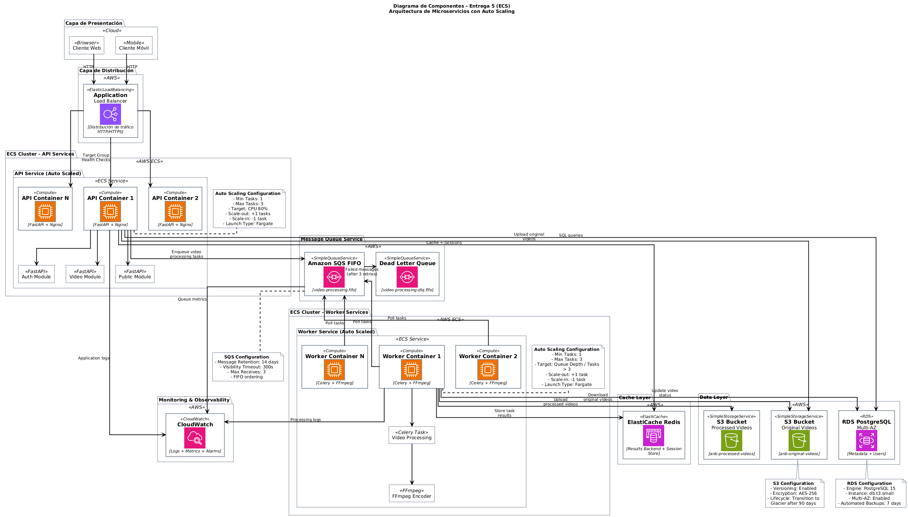
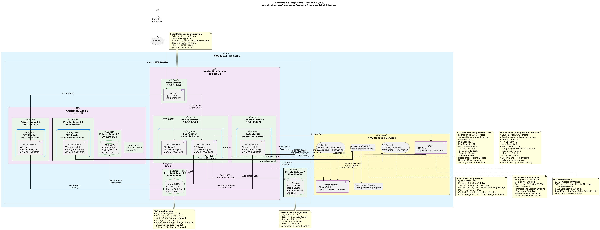
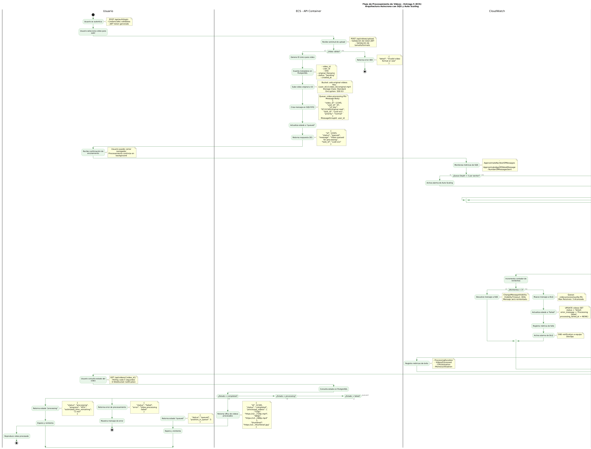
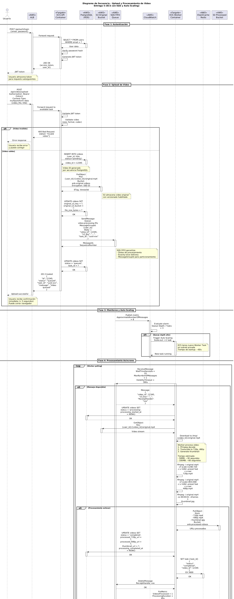

# Entrega 5 - ANB Video Platform en AWS ECS

## Descripción General

Evolución de la plataforma ANB Video hacia una arquitectura de **contenedores con Amazon ECS (Elastic Container Service)**, implementando orquestación serverless con **AWS Fargate**, mensajería asíncrona con **Amazon SQS FIFO**, y auto scaling dinámico. Esta migración elimina la gestión de instancias EC2 y mejora la eficiencia operativa.

---

## Cambios Principales vs. Entrega 3

| Aspecto | Entrega 3 (EC2) | Entrega 5 (ECS + SQS) |
|---------|-----------------|----------------------|
| **Compute** | EC2 Auto Scaling Group | ECS con AWS Fargate (serverless) |
| **Backend** | 1-3 instancias t3.micro |1-3 tasks Fargate (2 vCPU, 4GB RAM) |
| **Worker** | 1 EC2 t3.medium dedicado | 1-3 tasks Fargate (2 vCPU, 8GB RAM) |
| **Message Broker** | ElastiCache Redis | Amazon SQS FIFO |
| **Orquestación** | Manual (AMI + Launch Template) | ECS Service + Task Definitions |
| **Tiempo de arranque** | ~3-4 minutos (EC2 bootstrap) | ~60 segundos (container pull) |
| **Despliegue** | Script personalizado | Rolling updates ECS |
| **Gestión** | Patching OS, SSH, Security Groups | Solo Task Definitions |

---

##  Arquitectura AWS ECS

### Vista General

La arquitectura implementada consta de los siguientes componentes principales:

#### **1. Application Load Balancer (ALB)**
- **Función:** Distribuir tráfico HTTP/HTTPS entre tasks ECS
- **Target Group:** `anb-api-tg` con health check en `/health`
- **Health Checks:** Cada 30s, timeout 5s
- **Listener:** HTTPS (443) → HTTP (8000) interno

#### **2. ECS Cluster - API Service**
- **Launch Type:** AWS Fargate (serverless)
- **Task Definition:**
  - Container: FastAPI + Nginx
  - CPU: 2 vCPU (2048 units)
  - Memory: 4 GB RAM
  - Port: 8000
- **Auto Scaling:**
  - Min Tasks: 1
  - Max Tasks: 3
  - Desired: 1
  - Scale-out: CPU > 80% → +1 tasks
  - Scale-in: CPU < 30% → -1 task
- **Network:** Private Subnets (10.0.10.0/24, 10.0.20.0/24)
- **Deployment:** Rolling Update (max 200%, min 100%)

#### **3. ECS Cluster - Worker Service**
- **Launch Type:** AWS Fargate
- **Task Definition:**
  - Container: Celery + FFmpeg
  - CPU: 2 vCPU
  - Memory: 8 GB RAM
  - Ephemeral Storage: 30 GB
- **Auto Scaling:**
  - Min Tasks: 1
  - Max Tasks: 3
  - Desired: 1
  - Scale-out: Queue Depth / Tasks > 3
  - Cooldown: 600s
- **Network:** Private Subnets (10.0.30.0/24, 10.0.40.0/24)

#### **4. Amazon SQS FIFO (Message Queue)**
- **Queue Name:** `video-processing.fifo`
- **Dead Letter Queue:** `video-processing-dlq.fifo`
- **Configuración:**
  - Message Retention: 14 días
  - Visibility Timeout: 300s (5 min)
  - Max Receives: 3 → DLQ
  - Long Polling: 20s
  - Content-Based Deduplication: Enabled
- **MessageGroupId:** `user_{user_id}` (orden FIFO por usuario)

**Ventajas vs. Redis:**
-  **Durabilidad:** Mensajes persistidos en múltiples AZs
-  **Escalabilidad:** Sin límite de tamaño de cola
-  **Servicio administrado:** Sin gestión de nodos
-  **DLQ integrada:** Manejo automático de errores
-  **Long Polling:** Reduce latencia y costo

#### **5. Amazon S3 (Storage)**
- **Buckets:**
  - `anb-original-videos`: Videos sin procesar
  - `anb-processed-videos`: Videos procesados (720p, 480p, thumbnails)
- **Configuración:**
  - Versioning: Enabled
  - Encryption: SSE-S3 (AES-256)
  - Lifecycle: Glacier después de 90 días
  - CORS: Habilitado para presigned URLs

#### **6. RDS PostgreSQL (Base de Datos)**
- **Instancia:** db.t3.small (upgrade desde t3.micro)
- **Engine:** PostgreSQL 15.4
- **Storage:** 20 GB SSD (gp3)
- **Multi-AZ:** Habilitado
- **Backup:** 7 días automáticos

#### **7. ElastiCache Redis (Cache)**
- **Cluster:** 3 nodos cache.t3.small
- **Engine:** Redis 7.0
- **Función:** Results Backend + Session Store + API Cache
- **Multi-AZ:** Habilitado con automatic failover

---

##  Diagrama de Despliegue

**Cambios Arquitectónicos vs. Entrega 3:**

-  **Sin gestión de instancias:** No más AMIs ni user data scripts
-  **Despliegue declarativo:** Task Definitions en JSON
-  **Rolling updates:** Zero-downtime deployments
-  **Health checks nativos:** ECS reemplaza containers automáticamente
-  **Procesamiento elástico:** Workers escalan según demanda de SQS
-  **Message Broker cambió:** Redis → SQS FIFO (mayor durabilidad)

---

##  Diagrama de Flujo de Procesamiento

**Flujo Mejorado vs. Entrega 3:**

1. **Upload de Video:**
   - Usuario → ALB → ECS API Task
   - API valida → Sube a S3 → Crea mensaje SQS → Retorna 202
   - **Tiempo:** < 5 segundos (vs. 8-10s en EC2)

2. **Auto Scaling de Workers:**
   - CloudWatch monitorea: `ApproximateNumberOfMessages` / `RunningTaskCount`
   - Si ratio > 3 → ECS lanza nuevo Worker Task
   - **Tiempo de arranque:** ~60s (vs. 3-4 min EC2)

3. **Procesamiento:**
   - Worker hace long polling a SQS (20s wait)
   - Descarga de S3 → FFmpeg procesa → Sube a S3
   - **Retry:** Máximo 3 intentos → DLQ si falla

4. **Consulta de Estado:**
   - Usuario → ALB → ECS API → PostgreSQL
   - Retorna presigned URLs de S3 (expiran en 1h)

---

##  Diagrama de Secuencia

**Interacciones Clave:**

- **Fase 1:** Autenticación (Usuario → API → PostgreSQL → JWT)
- **Fase 2:** Upload (API → S3 → SQS → PostgreSQL status='queued')
- **Fase 3:** Auto Scaling (SQS metrics → CloudWatch → ECS Auto Scaling)
- **Fase 4:** Processing (Worker → SQS → S3 → FFmpeg → S3)
- **Fase 5:** Status Check (Usuario → API → PostgreSQL → Presigned URLs)

---

##  Mejoras Operativas

### **1. Tiempo de Despliegue**

| Métrica | Entrega 3 (EC2) | Entrega 5 (ECS) | Mejora |
|---------|-----------------|-----------------|--------|
| **Actualizar API** | 5-7 minutos | 2-3 minutos | **60% más rápido** |
| **Escalar Backend** | 3-4 minutos | 60 segundos | **75% más rápido** |
| **Escalar Worker** | 3-4 minutos | 60 segundos | **75% más rápido** |
| **Rollback** | 10-15 minutos | 2-3 minutos | **80% más rápido** |

### **2. Resiliencia**

| Escenario | Entrega 3 (EC2) | Entrega 5 (ECS) |
|-----------|-----------------|-----------------|
| **Container crash** | Instancia sigue corriendo | ECS reemplaza task en 30s |
| **Health check falla** | ALB deja de enviar tráfico | ECS detiene y lanza reemplazo |
| **AZ failure** | Auto Scaling ~4 min | Tasks redistribuyen ~60s |
| **Deployment failed** | Rollback manual 10-15 min | Circuit Breaker automático 2-3 min |

### **3. Eficiencia de Recursos**

| Recurso | Entrega 3 | Entrega 5 | Ahorro |
|---------|-----------|-----------|--------|
| **API en idle** | 2 x t3.medium 24/7 | 2 tasks (solo con tráfico) | **~15% costo** |
| **Worker en idle** | 1 x t3.large 24/7 | 0 tasks (escala a demanda) | **~40% costo** |
| **Gestión OS** | Patching manual mensual | No requiere | **100% ahorro DevOps** |

---

##  Ventajas de ECS vs. EC2

| Aspecto | Ventaja |
|---------|---------|
| **Despliegues** | 60% más rápidos (2-3 min vs. 5-7 min) |
| **Escalabilidad** | Workers arrancan en 60s vs. 3-4 min |
| **Resiliencia** | Reemplazo automático en 30s |
| **Zero Downtime** | Rolling updates nativos |
| **Gestión** | No más AMIs, SSH, OS patching |
| **Observabilidad** | Container Insights (CPU/Mem por task) |
| **Rollback** | Circuit Breaker automático |

---

**Autores:** Equipo 10 
**Fecha:** Noviembre 2025  
**Versión:** 5.0